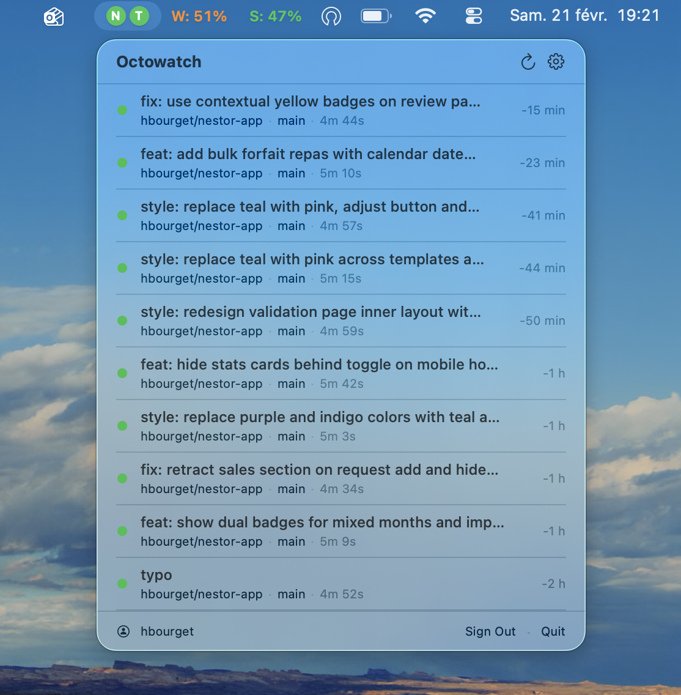

# Octowatch

A lightweight, native macOS menu bar app that monitors your GitHub Actions workflow runs in real time.

Built with SwiftUI. No external dependencies. No tracking. No data collection.



## Features

- **Menu bar status indicator** — see the state of your workflows at a glance
- **Multi-repo monitoring** — track workflow runs across multiple repositories
- **Configurable polling** — set your own refresh interval
- **Native notifications** — get notified when workflow runs complete (with distinct sounds for success and failure)
- **Secure by design** — your GitHub token is stored in the macOS Keychain and never leaves your machine

## Privacy

Octowatch is fully local. It does not collect, store, or transmit any data to external servers. Your GitHub Personal Access Token is stored exclusively in the macOS Keychain. Preferences are saved locally via UserDefaults. There is no analytics, no telemetry, no phone-home behavior of any kind.

## Requirements

- macOS 14.0 or later
- Swift 6.0+ (to build from source)
- A [GitHub Personal Access Token](https://github.com/settings/tokens) with `repo` and `actions` read access

## Installation

### Build from source

Clone the repository and use the provided Makefile:

```bash
git clone https://github.com/hugobourget/octowatch.git
cd octowatch
make run
```

This builds a release `.app` bundle and launches it. The app lives in your menu bar — there is no Dock icon.

### Other make targets

```bash
make build    # Debug build
make release  # Release build
make bundle   # Build .app bundle (release) without launching
make open     # Launch an existing bundle (no rebuild)
make clean    # Remove build artifacts and .app bundle
```

## Usage

1. Launch Octowatch — it appears in your menu bar
2. Click the icon and sign in with your GitHub Personal Access Token
3. Select the repositories you want to monitor
4. Octowatch will poll GitHub Actions and update the menu bar indicator in real time

## Tech Stack

| | |
|---|---|
| **Language** | Swift 6.0 (strict concurrency) |
| **UI** | SwiftUI |
| **Architecture** | MVVM |
| **Dependencies** | None — stdlib, Foundation, SwiftUI, UserNotifications only |
| **Min. deployment** | macOS 14.0 |

## 🔒 Note on the macOS Keychain Prompt

Because Octowatch is currently a free, open-source project, the downloaded app is not signed with a paid Apple Developer Developer ID.

Because of this built-in macOS security feature, the system will ask for your permission the first time Octowatch tries to retrieve your GitHub token from the Keychain.

**To fix this:**
When the prompt appears, enter your Mac password and click **"Always Allow"**. macOS will remember this preference and the app will run silently in the background from then on.

> **Note:** If this project gets enough traction and users, I plan to purchase an official Apple Developer license to properly code-sign the app, which will prevent this prompt from appearing at all.

## License

This project is licensed under the [MIT License](LICENSE).
